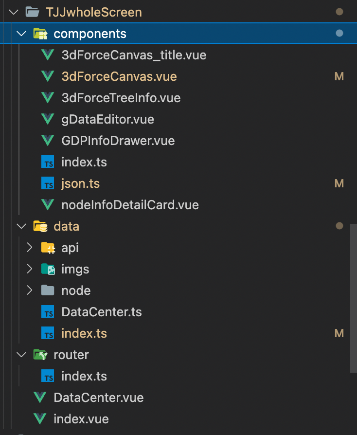

<!--
 * @Date: 2021-12-30 11:00:24
 * @LastEditors: CZH
 * @LastEditTime: 2022-09-18 11:00:37
 * @FilePath: /configforpagedemo/README.md
-->

# configForDesktopPage

项目地址：[体验地址](http://42.192.134.238/workbench/#/)
项目仓库：[configForDesktopPage](https://github.com/czhmisaka/ConfigForDesktopPage)
这是一款针对web小团队协作开发用的组件，可以有效的复用代码，开发的同时产出组件的使用说明和文档。
通过引入GridDesktop组件，输入组件配置列表，即可使用组件构建出一个简单的界面。
同时在桌面页面中也配置了一些基础配置动画和配置工具，方便开发调试。

## 桌面

桌面本身也是一个组件，可以在项目中按需引用。
具体路径：
*@/components/basicComponents/grid/gridDesktop.vue*
使用参考配置

```html
<template>
    <gridDesktop @onChange="onChange" :grid-col-num="12" :desktopData="testData" :cusStyle="cusStyle"/>
</template>
```

具体组件载入数据的配置详情可参考

```Typescript
const props = {
    // 自定样式
    cusStyle: {
      type: Object,
      default: () => {
        return {} as {
          // 全屏幕展示
          wholeScreen?: boolean;
          maxRows?: number;
          [key: string]: any;
        };
      },
    },

    // 可编辑状态 // 目前尚未实装功能
    editable: {
      type: Boolean,
      default: false,
    },

    // 渲染间隔
    gridColNum: {
      type: Number,
      default: 12,
    },

    // 可以使用的组件列表
    desktopData: {
      type: Array,
      default: () => {
        return testData as Array<gridCellTemplate>;
      },
    },
  },
```

### CardApi

通过封装对于onChange事件的操作，gridDesktop组件将会拥有更加广泛易用的组件操作能力

#### setData

功能描述：一个用于交互桌面组件BaseData数据的函数，本质是分装了gridDesktop的onChange操作，关于GridDesktop能响应的组件操作，可以参考 *组件-基座*

```Typescript
/**
 * @name: setData
 * @description: 简易组件数据推送到桌面baseData的工具
 * @authors: CZH
 * @Date: 2022-07-29 16:25:14
 */
export const setData = (content: {
    [key: string]: any
}, value: { [key: string]: any }): void => {
    if (!checkContext(content, value)) return;
    try {
        let func = content['$emit'] ? '$emit' : 'emit';
        content[func]('onChange', deepClone(value), {
            type: [
                cardOnChangeType.onChange
            ]
        })
    } catch (err) {
        console.error('setData_数据上报错误:', err, content, value);
    }
}
```


#### changeVisible

功能描述：一个用于设置组件显影状态的函数，可以触发组件的fade in out 动画

```TypeScript
/**
 * @name: changeVisible
 * @description: 组件可视状态修改
 * @authors: CZH
 * @Date: 2022-08-17 20:07:07
 * @param {object} content
 * @param {object} value
 */
export const changeVisible = (content: { [key: string]: any }, value: { [key: string]: Boolean }) => {
    if (!checkContext(content, value)) return;
    try {
        let func = content['$emit'] ? '$emit' : 'emit';
        let data = {} as gridCellOptions;
        Object.keys(value).map((name: string) => {
            data[name] = {
                options: { showInGridDesktop: value[name] }
            }
        })
        content[func]('onChange', data, {
            type: [
                cardOnChangeType.cardConfigChange
            ]
        })
    } catch (err) {
        console.error('changeVisible 错误:', err, content, value);
    }
}
```

#### changeCardPosition
功能描述：一个用于设置组件位置状态的函数，可以触发组件的位移动画

```Typescript
/**
 * @name: changeCardPosition
 * @description: 使用组件名称修改组件位置
 * @authors: CZH
 * @Date: 2022-08-17 21:01:15
 * @param {object} content
 * @param {object} value
 */
export const changeCardPosition = (content: { [key: string]: any }, value: { [key: string]: gridPositionCell }) => {
    if (!checkContext(content, value)) return;
    try {
        let func = content['$emit'] ? '$emit' : 'emit';
        let data = {} as gridCellOptions;
        Object.keys(value).map((name: string) => {
            data[name] = {
                gridInfo: {
                    default: {
                        position: value[name]
                    }
                }
            }
        })
        content[func]('onChange', data, {
            type: [
                cardOnChangeType.cardConfigChange
            ]
        })
    } catch (err) {
        console.error('changeVisible 错误:', err, content, value);
    }
}
```


#### changeCardSize
功能描述：一个用于设置组件大小的函数，可以触发组件的变形动画


```Typescript
/**
 * @name: changeCardSize
 * @description: 使用组件名称修改组件Size
 * @authors: CZH
 * @Date: 2022-08-17 21:01:15
 * @param {object} content
 * @param {object} value
 */
export const changeCardSize = (content: { [key: string]: any }, value: { [key: string]: gridSizeCell }) => {
    if (!checkContext(content, value)) return;
    try {
        let func = content['$emit'] ? '$emit' : 'emit';
        let data = {} as gridCellOptions;
        Object.keys(value).map((name: string) => {
            data[name] = {
                gridInfo: {
                    default: {
                        size: value[name]
                    }
                }
            }
        })
        content[func]('onChange', data, {
            type: [
                cardOnChangeType.cardConfigChange
            ]
        })
    } catch (err) {
        console.error('changeVisible 错误:', err, content, value);
    }
}


```


#### changeCardProperties
功能描述：用于修改组件props参数的函数，

```Typescript
/**
 * @name: changeCardProperties
 * @description: 修改组件配置参数
 * @authors: CZH
 * @Date: 2022-09-08 10:06:40
 * @param {object} content
 * @param {*} value
 */
export const changeCardProperties = (content: { [key: string]: any }, value: { [key: string]: any }) => {
    if (!checkContext(content, value)) return;
    try {
        let func = content['$emit'] ? '$emit' : 'emit';
        let data = {} as gridCellOptions;
        Object.keys(value).map((name: string) => {
            data[name] = {
                options: {
                    props: { ...value[name] }
                },
            }
        })
        content[func]('onChange', data, {
            type: [
                cardOnChangeType.cardConfigChange
            ]
        })
    } catch (err) {
        console.error('changeVisible 错误:', err, content, value);
    }
}
```

## 组件

### 组件-基座

组件底座
*@/components/basicComponents/grid/module/gridCard/card.vue*

组件底座将会基于组件本身属性提供以下功能

1. 属性配置界面，可以实时配置属性
2. 提供emit事件可以单独配置组件加载状态
3. 提供组件布局（需要组件本身支持响应式布局）
4. 依照组件配置项可以快速生成组件文档

桌面组件将会响应以下onChange事件类型

```Typescript
export enum cardOnChangeType {
    upOnChange = 'upOnChange',
    onChange = 'onChange',
    forceRefresh = 'forceRefresh',
    forceRefreshToOrgin = 'forceRefreshToOrgin',
    gridCardListonChange = 'gridCardListonChange',
    cardConfigChange = 'cardConfigChange',
    cardEdit = 'cardEdit',
    cardDelete = 'cardDelete',
    openComponentsList = 'openComponentsList',
}
```

### 组件-通用功能

通用功能基于emit事件实现

### 组件-注册方式

一般项目内部使用的组件都可以依照原先的组件编写方式进行编写，使用函数cardComponentMaker注册到componentLists中。

```TypeScript

/**
 * @name: cardComponentMaker
 * @description: 可用组件生成器
 * @authors: CZH
 * @Date: 2022-05-19 14:06:02
 */
export const cardComponentMaker = (
    component: any,
    props: {
        [key: string]: {
            label: string,
            type: inputType,
            localData?: {
                [key: string]: any,
            }
        }
    },
    baseProps: { [key: string]: any },
    compontentInfo: {
        description?: string,
        label?: string,
        group?: string,
        context?: Array<any>,
        gridInfo?: { [key: string]: gridSizeCell },
        [key: string]: any
    } = {},
): CardComponentTemplate => {
    let cardComponent = {
        name: compontentInfo.label,
        settngDetail: {
            props,
            baseProps,
        },
        compontentInfo,
        component,
    } as CardComponentTemplate;
    return cardComponent;
}

```

### 组件-加载方案

这里会按照不同的加载方式执行对应的组件加载
**一般在内部项目开发时间，推荐使用componentList加载方式**

```Typescript
/**
 * @name: cardComponentType
 * @description: 组件加载方式
 * @authors: CZH
 * @Date: 2022-05-16 18:43:10
 */
export enum cardComponentType {
    componentList = 'componentList',
    fromData = 'fromData', // 不推荐使用data保存组件
    cusComponent = 'cusComponent', // 使用自定义组件
}
```

### 组件-加载方案-componentList

通过组件name加载对应的组件，组件存储在 componentList对象中
当前项目的地址为 *@/components/basicComponents/grid/module/gridCard/module/componentLists.ts*

### 组件-加载方案-fromData

功能开发中
通过组件name加载对应的组件，组件数据将会保存在注册桌面组件对象时的data中，在运行时会通过data构建独立的组件

```Typescript
/**
 * @name: cardComponent
 * @description: 组件对象
 * @authors: CZH
 * @Date: 2022-05-19 16:00:11
 */
export interface cardComponent {
    name: string,
    type: cardComponentType,
    data?: string,
    getFunc?: (data: any) => any,
}
```

### 组件-加载方案-cusComponent

功能开发中，尽情期待
提供一个执行函数，需要后端服务器配合完成挂在现有的基于vue3构建的项目

# 实践

## 一个新模块的项目结构

1. 模块内的的组件可以单独放一个文件夹，使用index.ts透出一份组件列表，同时需要在compontList.ts中引入
2. data中用于存放当前模块中的API，图片，配置数据等资源
3. 单独存放一个Router编写当前组件的路由
4. index.vue中可以通过加载不同的桌面配置文件来切换当前页面的功能



**图片仅作为示范，并非本项目内容**

## 一些开发过程中需要注意的地方

### 避免需要重构的结构性风险

1. 避免对Props对象引用赋值,掌握组件数据流向
2. 避免循环调用setData
3. 组件数据保持独立性，避免使用vuex和localStorage

### 保证对于数据接口的极简依赖

1. 本质上是数据和渲染的分离，props中的数据接口参数和配置组件渲染方式的参数不应该有耦合

## 项目启动和调试

### Project setup

```shell
npm install
```

#### Compiles and hot-reloads for development


```shell
npm run dev
```

#### Compiles and minifies for production

```shell
npm run build
```

--------------------------------
